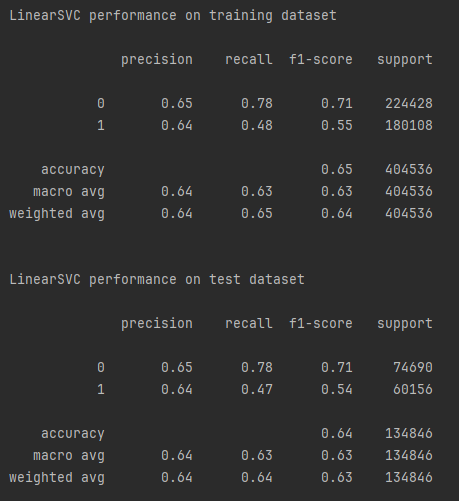
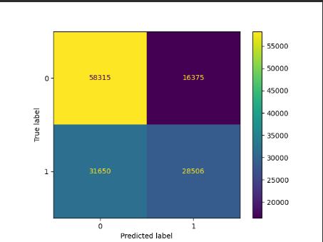
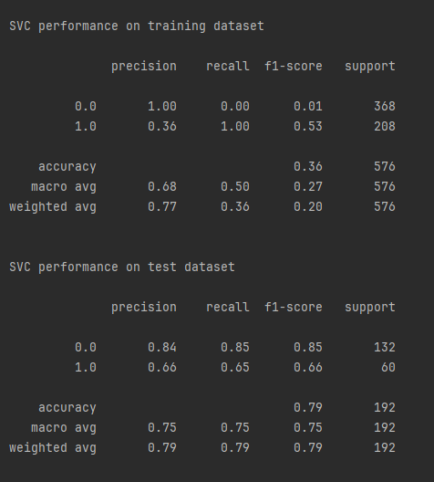
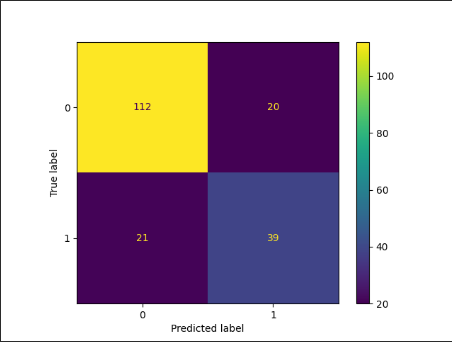

NAI Projekt 4

'''
Authors:
Rutkowski Marcin s12497
Stankiewicz Kacper s22619

Environment preparation:
pip install numpy
pip install matplotlib
pip install sklearn
pip install seaborn
pip install pandas
'''

Ailrines Delay DTree

Airlines Delay SVM

Pima Indians Diabetes DTree

Pima Indians Diabetes SVM

